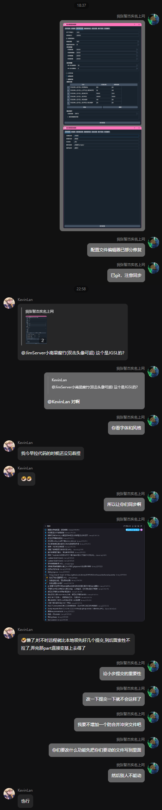

# 这个文件是干什么用的？

用于防止合并冲突，计划做任何更改前，请先将你要更改的文件放到这里，任何人都不能更改这里写到的文件，有效期为七天，超过需更新。

# 为什么会有这个文件？

请看VCR:

## 格式：

`[日期]-[时间](UTC时区) [你的GitHub用户名] [要更改的文件] [原因]`

## 示例：

 - 2025/01/01-00:00(UTC+08:00) Jimmy32767255 JGSL/main.py 优化异常处理

# 列表：

